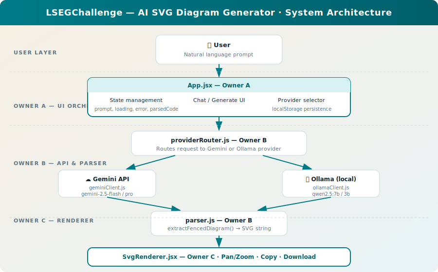
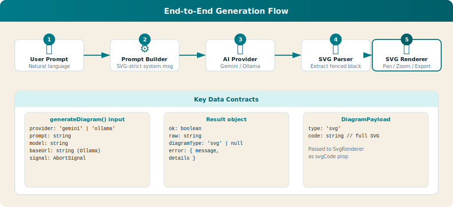
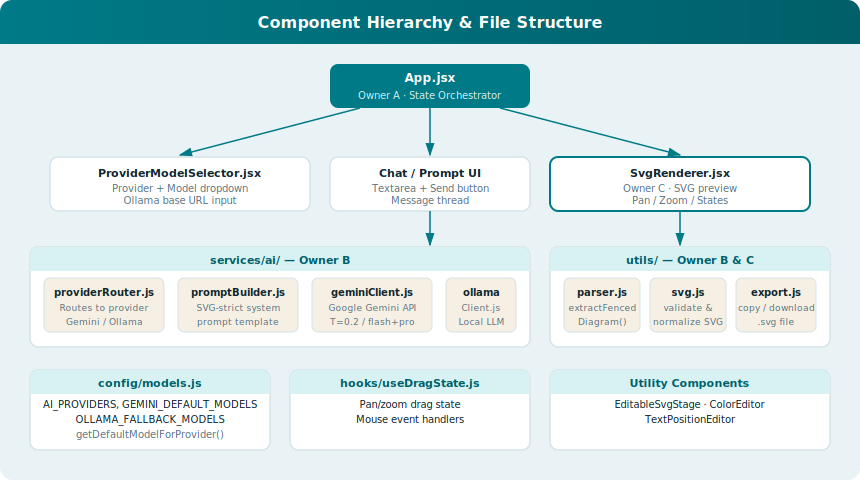

# 🖼️ AI SVG Diagram Generator — LSEGChallenge

> **Describe any diagram in plain English, let an AI model generate it as SVG, then preview, pan/zoom, copy or download it — all in the browser.**

[](https://react.dev)
[](https://vitejs.dev)
[](https://ai.google.dev)
[](https://ollama.com)
[](LICENSE)

---

## 📸 Application Preview

The application is a two-panel React workspace:

| Panel | Contents |
|-------|----------|
| **Left — Chat / Input** | Chat thread, provider + model selector, prompt composer, action buttons |
| **Right — Preview** | Live SVG render with pan/zoom, copy to clipboard, download `.svg` |

> _Generate a diagram, then refine it by sending follow-up messages in the same chat session. Each message can modify the current SVG._

---

## 🏗️ System Architecture

The application follows a layered architecture with clear ownership boundaries:



### Layer breakdown

| Layer | Owner | Responsibility |
|-------|-------|----------------|
| **UI Orchestration** | A | `App.jsx` — state, routing, chat history, provider selection |
| **API & Parser** | B | `providerRouter` → Gemini / Ollama → `extractFencedDiagram` |
| **Renderer** | C | `SvgRenderer` — display, pan/zoom, copy, download |

---

## 🔄 End-to-End Generation Flow



1. **User** types a natural-language diagram request.
2. **Prompt Builder** wraps it in a strict SVG-only system message.
3. **AI Provider** (Gemini cloud _or_ Ollama local) returns a fenced ` ```svg ``` ` block.
4. **Parser** extracts and validates the `<svg>…</svg>` markup.
5. **SVG Renderer** displays the result with pan/zoom and export controls.

---

## 🧩 Component Hierarchy



---

## ✨ Features

- 💬 **Conversational interface** — refine your diagram with follow-up chat messages
- ☁️ **Google Gemini** support (`gemini-2.5-flash`, `gemini-2.5-pro`, `gemini-2.0-flash`)
- 🖥️ **Ollama (local)** support — any locally installed model (e.g. `qwen2.5:7b`)
- 🔍 **Live SVG preview** with pan & zoom
- 📋 **Copy to clipboard** — paste the SVG directly into any vector editor
- ⬇️ **Download `.svg`** with a custom filename
- 💾 **Persistent chat history** saved to `localStorage`
- ⚡ **Abort in-flight requests** when switching providers

---

## 🚀 Quick Start

### Prerequisites

| Tool | Version |
|------|---------|
| Node.js | ≥ 18 |
| npm | ≥ 9 |
| (Optional) Ollama | latest |

### 1 — Clone & install

```bash
git clone https://github.com/Robi2710/LSEGChallenge.git
cd LSEGChallenge/frontend-diagram
npm install
```

### 2 — Configure environment

```bash
cp .env.example .env
```

Edit `.env`:

```env
# Required for Gemini provider
VITE_GEMINI_API_KEY=your_key_here

# Default provider: gemini | ollama
VITE_DEFAULT_PROVIDER=ollama

# Ollama base URL (change if running on another host/port)
VITE_OLLAMA_BASE_URL=http://localhost:11434

# Default models (can be overridden in the UI)
VITE_GEMINI_MODEL=gemini-2.0-flash
VITE_OLLAMA_MODEL=qwen2.5:7b
```

### 3 — (Optional) Start Ollama

```bash
ollama serve
ollama pull qwen2.5:7b   # or any other model
```

### 4 — Run the dev server

```bash
npm run dev
# → http://localhost:5173
```

### 5 — Build for production

```bash
npm run build
npm run preview   # serves the dist/ folder locally
```

---

## 📁 Project Structure

```
LSEGChallenge/
├── README.md                          ← you are here
├── TEAM_IMPLEMENTATION_GUIDE.md       ← team ownership rules
├── docs/
│   └── diagrams/                      ← architecture SVG diagrams
│       ├── architecture.svg
│       ├── flow.svg
│       └── components.svg
└── frontend-diagram/                  ← React/Vite application
    ├── .env.example
    ├── package.json
    ├── vite.config.js
    └── src/
        ├── App.jsx                    ← Owner A: UI shell + state
        ├── components/
        │   ├── SvgRenderer.jsx        ← Owner C: SVG display
        │   └── ProviderModelSelector.jsx
        ├── services/ai/
        │   ├── providerRouter.js      ← Owner B: dispatch
        │   ├── promptBuilder.js       ← Owner B: system prompt
        │   └── providers/
        │       ├── geminiClient.js
        │       └── ollamaClient.js
        ├── utils/
        │   ├── parser.js              ← Owner B: SVG extraction
        │   ├── svg.js                 ← Owner C: validation
        │   └── export.js              ← Owner C: copy/download
        ├── config/models.js
        └── hooks/useDragState.js
```

---

## 🤖 Supported AI Providers

### Google Gemini (cloud)

| Model | Notes |
|-------|-------|
| `gemini-2.5-flash` | Fastest, recommended default |
| `gemini-2.5-pro` | Highest quality |
| `gemini-2.0-flash` | Stable, widely available |

Requires `VITE_GEMINI_API_KEY` from [Google AI Studio](https://aistudio.google.com/app/apikey).

### Ollama (local)

Any model available via your local Ollama instance is automatically listed in the UI.  
Recommended models for SVG generation:

| Model | Size | Notes |
|-------|------|-------|
| `qwen2.5:7b` | ~4 GB | Best quality/size balance |
| `qwen2.5:3b` | ~2 GB | Good for low-VRAM machines |

---

## 🔧 Environment Variables Reference

| Variable | Default | Description |
|----------|---------|-------------|
| `VITE_GEMINI_API_KEY` | — | Google Gemini API key (required for Gemini) |
| `VITE_DEFAULT_PROVIDER` | `ollama` | Starting provider (`gemini` or `ollama`) |
| `VITE_OLLAMA_BASE_URL` | `http://localhost:11434` | Ollama server URL |
| `VITE_GEMINI_MODEL` | `gemini-2.0-flash` | Default Gemini model |
| `VITE_OLLAMA_MODEL` | `qwen2.5:7b` | Default Ollama model |

---

## 👥 Team Ownership

| Owner | Files | Responsibility |
|-------|-------|----------------|
| **A** | `App.jsx`, `App.css` | UI orchestration, state management, chat UX |
| **B** | `providerRouter.js`, `promptBuilder.js`, `geminiClient.js`, `ollamaClient.js`, `parser.js` | AI API pipeline and SVG extraction |
| **C** | `SvgRenderer.jsx`, `svg.js`, `export.js`, `useDragState.js` | SVG rendering, validation, export |

See [`frontend-diagram/TEAM_IMPLEMENTATION_GUIDE.md`](./frontend-diagram/TEAM_IMPLEMENTATION_GUIDE.md) for the full integration contracts and merge order.

---

## 📚 Further Documentation

- [`frontend-diagram/README.md`](./frontend-diagram/README.md) — app-specific setup notes
- [`frontend-diagram/TEAM_IMPLEMENTATION_GUIDE.md`](./frontend-diagram/TEAM_IMPLEMENTATION_GUIDE.md) — team contracts, integration checkpoints, manual test matrix
- [`frontend-diagram/IMPLEMENTATION_CHECKLIST.md`](./frontend-diagram/IMPLEMENTATION_CHECKLIST.md) — feature completion tracker

---

## 📄 License

This project is released under the [MIT License](LICENSE).
